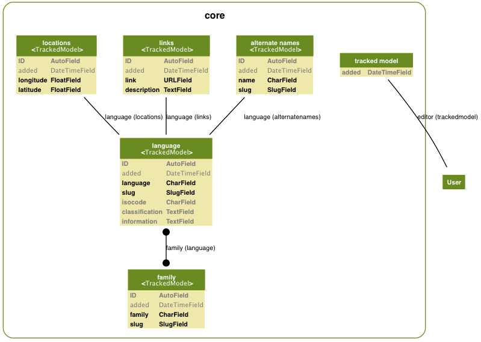

Database:
=========

Schema
------

Family
------

Contains language family/subgroup names. This is designed to be a broad
classification system with each language belonging to one or more "families". 

Table: *families*

==========       =============      ====     =======   =====   =================================
Field            Type               Size     Misc      Index   Details
----------       -------------      ----     -------   -----   ---------------------------------
family           CharField          64       Unique    +       Stores Language Family Name
slug             SlugField          64       Unique    +       "Slug" of family name for URLS.
==========       =============      ====     =======   =====   =================================
                                                         

Language
--------

Contains Language details.

Table: *languages*

==============  =============  ====  =======  =====   =================================
Field           Type           Size  Misc     Index   Details
--------------  -------------  ----  -------  -----   ---------------------------------
_family_        ManyToMany       NA  blank            Link to `Family` table
language        CharField        64  Unique   +       Stores Language Name
slug            SlugField        64  Unique   +       "Slug" of language name for URLS.
isocode         CharField         3  Blank    +       ISO-639-1 Code
classification  TextField      1024  Blank            Classification String
information     TextField      1024  Blank            Information
==============  =============  ====  =======  =====   =================================

AlternateNames
--------------

Contains Alternate Names for a Language. Handles languages with multiple names

Table: *altnames*

==============  =============  ====  =======  =====   =================================
Field           Type           Size  Misc     Index   Details
--------------  -------------  ----  -------  -----   ---------------------------------
*language*      ForeignKey       NA                   Link to `Language` table
name            CharField        64  Unique   +       Stores Language Name
slug            SlugField        64  Unique   +       "Slug" of language name for URLS.
==============  =============  ====  =======  =====   =================================

Links
-----

Contains links to language resources.

Table: *links*

==============  =============  ====  =======  =====   =================================
Field           Type           Size  Misc     Index   Details
--------------  -------------  ----  -------  -----   ---------------------------------
*language*      ForeignKey       NA                   Link to `Language` table
link            URLField         NA                   Stores URL of resource
description     TextField      1024                   Short description of resource
==============  =============  ====  =======  =====   =================================

Locations
---------

Contains links to language resources.

Table: *locations*

==============  =============  ====  =======  =====   =================================
Field           Type           Size  Misc     Index   Details
--------------  -------------  ----  -------  -----   ---------------------------------
*language*      ForeignKey       NA                   Link to `Language` table
longitude       FloatField       NA                   Longitude
latitude        FloatField       NA                   Latitude
==============  =============  ====  =======  =====   =================================

